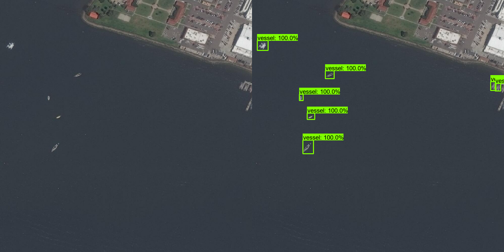

# NOAA-vessel-detector
A tool to detect vessels from high resolution satellite imagery

## Directory structure
Once Tensorflow is intalled and working, create the following directory structure inside /ProgramData/Anaconda3/Lib/site-packages/tensorflow/models/ to house the various components of the project.

```
workspace/
└─ vessel_detection/
   ├─ annotations/
   |  └─ xmls
   ├─ exported_models/
   ├─ images/
   |  ├─ matched
   |  ├─ raw
   |  ├─ test
   |  └─ train
   ├─ models/
   └─ pre-trained-models
```

## Training instructions
The first step is to manually divide the training images and xmls into a testing and training subset housed in images/train and images/test.  I recommend a 90/10 split training/testing.

In an AnacondaPrompt window navigate to your vessel_detection workspace and generate the label maps for both the training and testing images using the following commands substituting in your correct paths to images and annotations folders:

```
python generate_tfrecord.py -x Path/to/imagesfolder/train -l Path/to/annotationsfolder/label_map.pbtxt -o Path/to/annotationsfolder/train.record
python generate_tfrecord.py -x Path/to/imagesfolder/test -l Path/to/annotationsfolder/label_map.pbtxt -o Path/to/annotationsfolder/test.record
```

It is now time to train the model.  From an AnacondaPrompt window set to workspace/vessel_detection, run the following command:

```
python model_main_tf2.py --model_dir=models/my_ssd_resnet50_v1_fpn --pipeline_config_path=models/my_ssd_resnet50_v1_fpn/pipeline.config --checkpoint_every_n=100
```

Note that the checkpoint_every_n argument saves a checkpoint every 100 steps.  On a normal laptop training takes about 2-3 days.  To monitor the training activity open a new AnacondaPrompt and navigate to workspace/vessel_detection and run the following command:

```
tensorboard --logdir=models/my_ssd_resnet50_v1_fpn
```

Instructions will appear the local host address to copy to your browser, which will bring up the Tensorboard.

## Saving the trained model
The next step is to save the trained model so that it can be loaded and used for evaluation.  To save the trained model, stop the training by closing the AnacondaPrompt where the training command was run.  Open a new AnacondaPrompt and navigate to workspace/vessel_detection and run the following command:

```
python exporter_main_v2.py --input_type image_tensor --pipeline_config_path=models/my_ssd_resnet50_v1_fpn/pipeline.config --trained_checkpoint_dir=models/my_ssd_resnet50_v1_fpn --output_directory=exported_models/my_model
```

This will save the trained model to exported_models/my_model.

## Model evaluation


